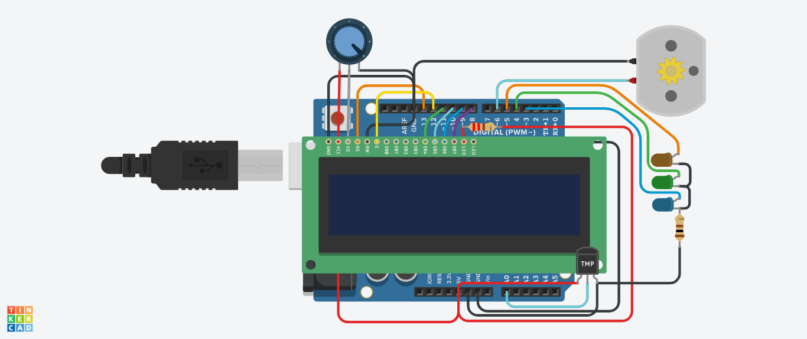

# Controlling Fan speed automatically

Here, I am using LCD, TMP36 (temperature sensor), a DC Motor, LEDs, Resistors, Potentiometer, Micro-controller (Arduino Uno) to control the speed of a fan based on the read temperature.

It has the following functionality:-
1.  It's controlling the speed of fan based on temperature
2.  It will turn the fan off in cold weather condition
3.  In display you can see the temperature and speed of fan
4.  LEDs indicating the mode
    1.  Orange - Too hot
    2.  Green - Normal
    3.  Blue - Too cold

<b>Project simulation link</b>

https://www.tinkercad.com/things/9eL6hKeO3Dj-copy-of-q6/editel?sharecode=CmWX8u7ISqYwlnBXQWK7J98tR5BoBJh9qMcCAMfo0Os
 
<b>Circuit Diagram</b>

